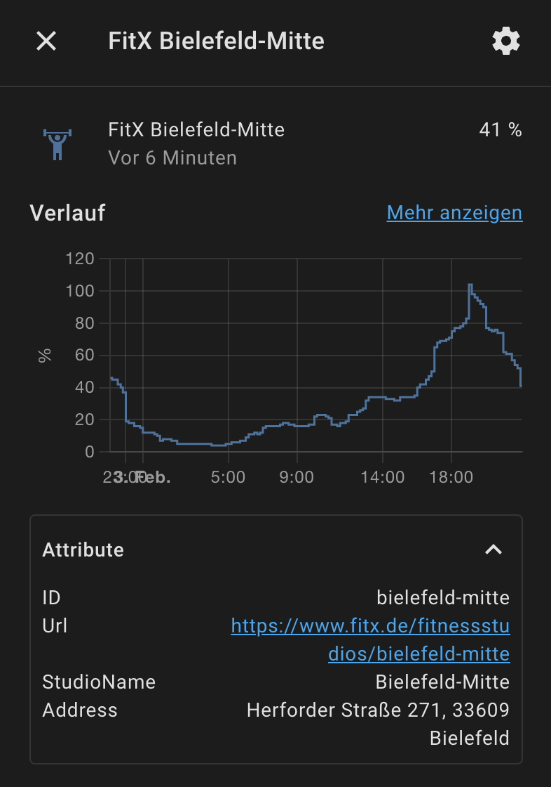

[](https://github.com/custom-components/hacs)
# 🏋️ FitX Gym Usage Sensor

## Installation

<!--### HACS

This component is easiest installed using [HACS](https://github.com/custom-components/hacs). -->

### 🔧 Manual installation

Copy the `fitx` folder from `custom_components/` to the `custom_components/`directory inside your config Home Assistant directory.

## Configuration

### Configuration Variables

| Name | Type | Default | Description |
|---|---|---|---|
| id **(required)** | string | | Name of the gym from [here](https://www.fitx.de/fitnessstudios "FitX Locations"). You need the `id` part `https://www.fitx.de/fitnessstudios/{id}` |
| name | string | Value of `id` | Name of the FitX usage sensor. |

### Example Configuration

So if the gym you want to track is https://www.fitx.de/fitnessstudios/berlin-alexanderplatz add the following to your `configuration.yaml`:

```yaml
sensor:
  - platform: fitx
    locations:
      - id: berlin-alexanderplatz
        name: Gym Berlin
```

### Sensor Attributes
- **id**: The `id` set in the config.
- **url**: The `URL` used for the web request.
- **studioName**: The gym location's name
- **address**: The address of the gym.

#### Example
